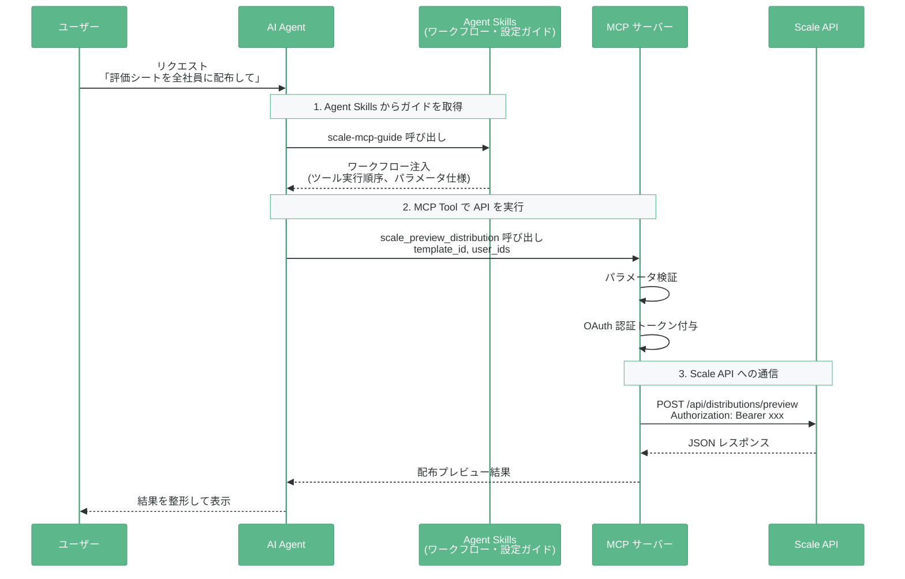

# Scale MCP Plugin for Claude Code

Scale人事評価システム（[scale-hr.io](https://scale-hr.io)）のMCPツールを効果的に活用するためのClaude Code Plugin。

## 機能

- **Agent Skill**: Scale MCPツールの使い方をClaude Codeに教えるガイド
- **MCP サーバー設定**: プラグインインストールでScale MCPサーバーが自動設定される
- **ロール別スキル**: 企業管理者向け（62ツール）と一般ユーザー向け（15ツール）を分離提供

### スキル一覧

| スキル | 対象ロール | ツール数 | 内容 |
|--------|-----------|---------|------|
| `scale-mcp-guide` | `company_admin` | 62 | テンプレート作成、評価シート配布、マスタ管理、データ分析、神の手操作 |
| `scale-mcp-guide-general` | `general` | 15 | 自分の評価シート確認・提出、1on1セッション、プロフィール管理、ダッシュボード |

MCPサーバーがログインユーザーのロールに応じて利用可能なツールを自動フィルタリングします。

## Agent Skills と MCP の通信の流れ



## インストール

### 1. Marketplace を追加

```
/plugin marketplace add colorful-box/scale-mcp-plugin
```

### 2. Plugin をインストール

ロールに応じて必要なスキルをインストールしてください。

**企業管理者（company_admin）の場合:**

```
/plugin install scale-mcp-guide
```

**一般ユーザー（general）の場合:**

```
/plugin install scale-mcp-guide-general
```

インストール後、Scale MCPサーバー（`https://mcp.scale-hr.io/mcp`）が自動設定されます。
初回接続時にブラウザでOAuth認証が求められます。

## 使い方

プラグインをインストールすると、Scale関連の依頼時にClaude Codeが自動的にガイドを参照します。

### 企業管理者の例

> 2026年度上期の評価期間を作成して、全社員に標準テンプレートで評価シートを配布して

Claude Code が以下のツールを自動的に実行します:

1. `scale_create_evaluation_period` → 評価期間を作成
2. `scale_list_templates` → テンプレート一覧から「標準」を特定
3. `scale_get_template` → テンプレート設定を確認
4. `scale_get_distribute_users` → 配布対象の全社員を取得
5. `scale_preview_distribution` → 配布プレビューで確認
6. `scale_distribute_sheets` → 全社員に評価シートを配布

### 一般ユーザーの例

> 今の自分の評価状況を教えて

Claude Code が以下のツールを自動的に実行します:

1. `scale_whoami` → 認証状態・ロールを確認
2. `scale_dashboard_summary` → 全体の評価状況サマリー
3. `scale_dashboard_my_sheets` → 自分の評価シート一覧
4. `scale_get_evaluation_sheet` → シート詳細を表示

> 評価シートを提出したい

Claude Code が以下のツールを自動的に実行します:

1. `scale_dashboard_my_sheets` → 自分のシート一覧
2. `scale_get_evaluation_sheet` → 提出対象のシート内容を確認
3. `scale_submit_evaluation_sheet` → ワークフローに沿って提出

## スキル構成

### 企業管理者向け（`scale-mcp-guide`）

| ファイル | 説明 |
|---------|------|
| `SKILL.md` | メインガイド（ワークフロー概要、テンプレート作成プロセス、削除・復元） |
| `references/workflows.md` | 詳細なワークフローパターン |
| `references/template_settings.md` | テンプレート設定の全パラメータと典型パターン例 |
| `references/template_excel_format.md` | Excel入力フォーマット仕様 |
| `references/tool_reference.md` | 全79ツールのカテゴリ別リファレンス |

### 一般ユーザー向け（`scale-mcp-guide-general`）

| ファイル | 説明 |
|---------|------|
| `SKILL.md` | メインガイド（ダッシュボード、シート提出、1on1、プロフィール） |
| `references/workflows.md` | ワークフロー詳細とユースケース |

## ライセンス

MIT
